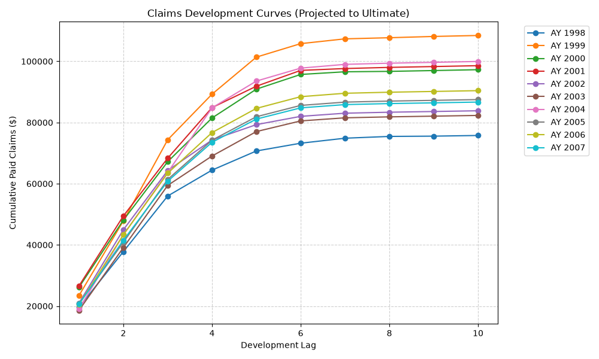
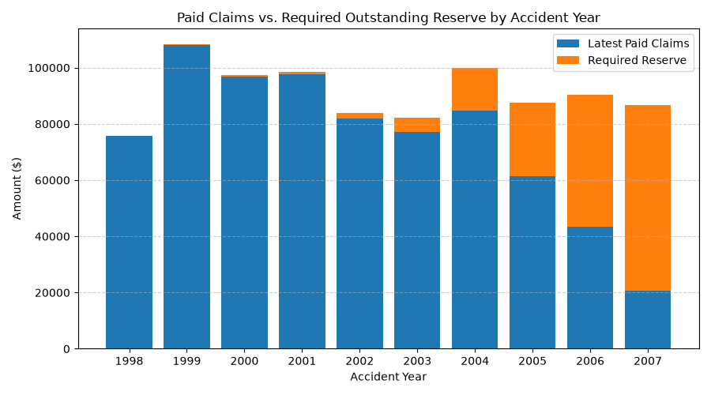

# Automated Loss Reserving Model (Chain Ladder Method)

## Overview
This project implements an automated **Chain Ladder Loss Reserving Model** in Python. Using historical general liability claims data, the model processes cumulative paid loss triangles, calculates volume-weighted link ratios, projects ultimate paid losses, and estimates the **Total Outstanding Reserves** required across accident years. 

## Features
* **Data Processing**: Filters and cleans loss development histories using `pandas`.
* **Triangle Construction**: Automatically builds cumulative and incremental paid loss triangles.
* **Loss Development Factors**: Computes volume-weighted link ratios and factors to ultimate.
* **Reserve Calculation**: Estimates ultimate paid claims and total outstanding reserves 'Ultimate - Latest Paid' per accident year.
* **Data Visualizations**: Generates claims development curves and stacked reserve distribution charts using `matplotlib`.

## Data Source & Acknowledgments
The dataset used in this project is sourced from the **Casualty Actuarial Society (CAS) Loss Reserving Database**, compiled on behalf of the CAS by **S&P Global Market Intelligence**.

* **Primary Source:** National Association of Insurance Commissioners (NAIC) Database (**Schedule P** – Analysis of Losses and Loss Expenses).
* **Line of Business:** Private Passenger Auto Liability/Medical (`PP Auto Data Set`).
* **Target Entity:** *Employers Mutual Company of Des Moines* (NAIC Group).
* **Data Scope:** 10 accident years (1998–2007) across 10 development lags.
* **Citation:** Data accessed via the [CAS Loss Reserving Data Page]([https://www.casact.org/](https://www.casact.org/publications-research/research/research-resources/loss-reserving-data-pulled-naic-schedule-p)), compiled by S&P Global Market Intelligence and original researchers Glenn G. Meyers, PhD, FCAS, and Peng Shi, PhD, ASA.

## Scope, Limitations & Future Enhancements

This repository provides a fundamental implementation of the basic Chain Ladder loss reserving method. Real-world actuarial applications require more advanced techniques to account for volatility, tail development, and structural shifts.

### Planned / Potential Extensions
* **Tail Factor Estimation**: Extend development beyond 10 lags using curve fitting to account for long-tailed claims settlement.
* **Stochastic Reserving (Mack's Method)**: Implement Mack's Chain Ladder model to estimate standard errors / confidence intervals around required reserves.
* **Bornhuetter-Ferguson (BF) Method**: Blend historical development factors with an a priori expected loss ratio to reduce reserve volatility in recent, immature accident years.
* **Diagnostic Reporting**: Calculate residual plots across development lags and accident years to test for inflation shifts or operational changes in claims handling.

## Output Visualizations

### Claims Development Curves
Shows cumulative paid loss trends across development lags for each accident year:

### Paid Claims vs. Required Reserves
Illustrates the proportion of paid losses versus required total outstanding reserves:

## Tech Stack
* **Language**: Python 3.x
* **Data Analysis**: `pandas`, `numpy`
* **Visualization**: `matplotlib`

> ## How to Run
> 1. Clone this repository:
>    `git clone [https://github.com/your-username/chain-ladder-claims-reserving.git](https://github.com/your-username/chain-ladder-claims-reserving.git)`
> 2. Install required dependencies:
>    `pip install -r requirements.txt`
> 3. Run the model:
>    `python reserving_model.py`

